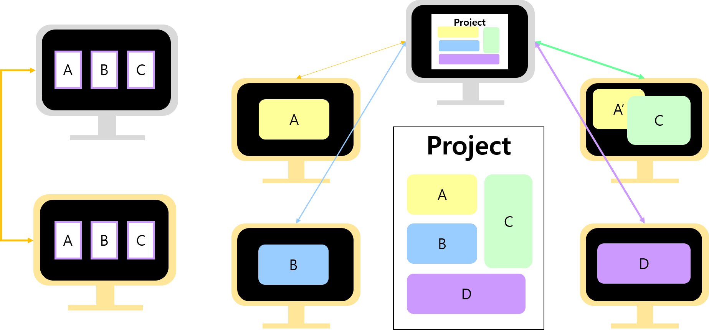
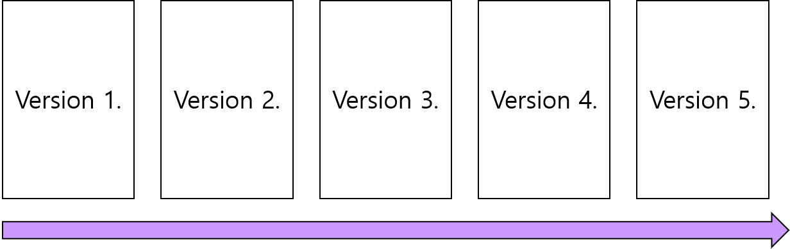

<subtitle>Intro. Git이란? </subtitle> 

## 1. **Git**이란?

- Git은 리누스 토발즈(Linus Torvalds)가 빠른 속도, 단순한 디자인, 비선형적 개발 지원, 완전 분산형 시스템 등의 목표를 갖고 개발한 *분산 버전 관리 시스템*이다.
- 버전 관리
- 동시 협업 가능
- 다른 컴퓨터 or 서버(대표적으로 github)에 작업물을 보낼 수 있다.
   - 내 컴퓨터에 문제가 생겨 파일이 사라졌을 때, 작업물을 쉽게 복구 가능.
</img> 

    * 버전관리란(Version Control)? 
        - 파일의 변화를 시간에 따라 기록했다가 특정 시점의 버전을 다시 꺼내올 수 있는 시스템.

        - 버전관리의 장점 
            1) 프로젝트 중, 과거의 특정 버전으로 돌아갈 수 있다. 
            2) 이전 버전으로 복구가 가능하다. 
            3) 프로젝트의 최종본을 만들기까지 과정을 확인할 수 있다. 
</img> 